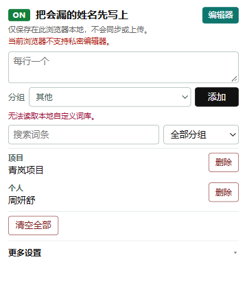
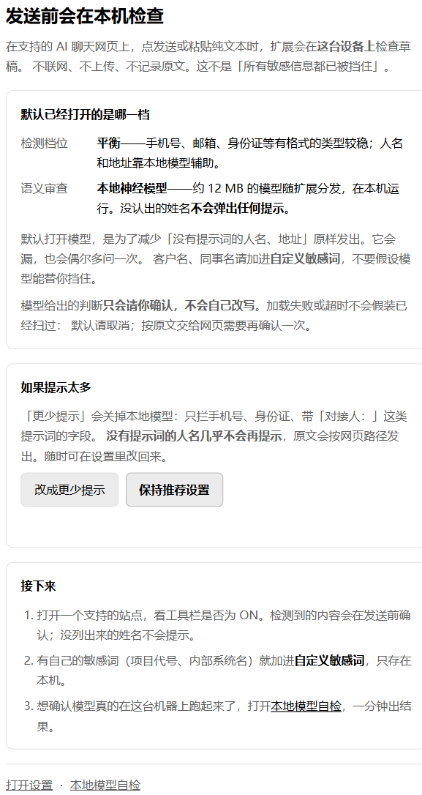
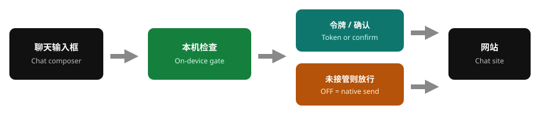
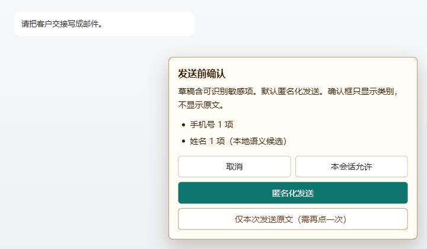

<p align="right">
  <a href="README.md">中文</a> · <strong>English</strong>
</p>

<p align="center">
  
</p>

<h1 align="center">AI Private Editor</h1>

<p align="center">
  Chromium MV3 local send-gate<br>
  <em>GPL-3.0-or-later · no backend · no network permission</em>
</p>

---

## What this is

On **verified chat composers** for Doubao, DeepSeek, Yuanbao, ChatGPT, Claude, Gemini, Kimi, Qwen, and Ernie, the extension inspects the draft **on this device** before Send or a plain-text paste:

- Structured values (phone, email, checksum-valid national ID, …) can be replaced with tokens such as `[[PHONE_001]]` before the site sees them.
- Secrets, strict mode, and model-proposed names/addresses require confirmation. The dialog lists **kinds and counts**, never the raw string.
- Put real names and project codenames in the local lexicon. It never syncs.

This is **not** “all sensitive text is blocked.” Names leak. A miss produces **no prompt**. Text typed into the page DOM can still be read by the site’s own scripts.

<p align="center">
  
</p>
<p align="center"><sub>Toolbar popup. ON = this page is hooked. The home view is for names the model will miss.</sub></p>

<p align="center">
  
</p>
<p align="center"><sub>First-run page. Default is balanced detection plus the on-device neural model. Unrecognized names produce no prompt.</sub></p>

---

## Does / does not

| Does | Does not |
|---|---|
| Checks on this device before send and plain-text paste | Scan existing chat history |
| Rules plus a ~12 MB local INT8 student model | Upload drafts to any server of this extension (no network permission) |
| Toolbar **ON** / **OFF** for whether this page is hooked | Guarantee every name or address is found |
| Lexicon, allowlist, and policies stay in `chrome.storage.local` | Inspect attachment/image **content**, rich paste, or uploads the page already started |
| Fail closed if the model is unavailable: cancel or explicitly send raw | 等保 / PIPL certification / DLP |

---

## Send path

<p align="center">
  
</p>

1. You type on a supported page. The extension does not rewrite keystrokes as you go.
2. On Send (click or the site shortcut), it first checks that the editor and send control still exist.
3. **ON**: local rules (and the optional model). Replacements become tokens and are replayed once; confirmations pause the send.
4. **OFF / no badge**: not hooked. The page sends natively. Do not treat that tab as protected.

<p align="center">
  
</p>
<p align="center"><sub>Confirmation. Default is anonymize. Raw send is a dangerous action and requires a second click.</sub></p>

---

## Toolbar

| Badge | Meaning |
|---|---|
| **ON** | Current composer is hooked. Misses can still go out. |
| **OFF** (toolbar `!`) | Health check failed; native send. |
| **—** | Unsupported site, or still checking. |

An empty composer that hides the send button can still be **ON** (idle, not a broken adapter). Text in the box but no send control → **OFF**. The popup’s ON/OFF badge uses the same source as the toolbar.

---

## Reliable vs assistive

**Reliable (format + checksums)**  
Phone, email, checksum-valid Chinese national ID, Luhn cards, passport, plate, unified social credit code, IP, local paths, API keys/tokens, private keys, connection strings, and values after a label plus `:` / `：` / `是` / `为` / `叫`.

**Assistive only (will miss)**  
Person names, addresses, account aliases: model candidates **always confirm**, never silent rewrite. Unrecognized values produce no prompt and leave via the site path. Put real names in the lexicon.

---

## Supported sites

| Site | Host | Login-path send |
|---|---|---|
| Doubao | `www.doubao.com`, `doubao.com` | Verify on your own account with synthetic text |
| DeepSeek | `chat.deepseek.com` | `/sign_in` unsupported; login path needs verification |
| Yuanbao | `yuanbao.tencent.com` | Public page attested; login path not release-verified |
| ChatGPT | `chatgpt.com` | Login path needs synthetic-text verification |
| Claude | `claude.ai` | Login/logout pages unsupported |
| Gemini | `gemini.google.com` | Empty input hides send; can still be ON |
| Kimi | `www.kimi.com` | Login path needs verification |
| Qwen | `www.qianwen.com` | Login path needs verification |
| Ernie | `yiyan.baidu.com`, `wenxin.baidu.com` | Login path needs verification |

Only a composer that passes the health check is hooked. If the site ships a DOM change and selectors break → OFF, native send.

---

## Install

Requires Chromium 116+ (Chrome / Edge). This repository is source, not a store package.

```powershell
git clone https://github.com/LiangyuLu-lly/ai-private-editor.git
cd ai-private-editor
npm install
npm test
npm run build
```

1. Open `chrome://extensions` (Edge: `edge://extensions`).
2. Enable Developer mode.
3. Load unpacked → select this repo’s `dist/`.
4. After every `npm run build`, click Reload on the extension, then refresh the chat tab.

`npm run test:browser` drives system Chrome. If CDP blocks temporary extension loads, those cases skip — they do not replace in-extension “本地模型自检”.

---

## Usage

1. Open a supported chat page and wait for **ON**.
2. Add names the model will miss on the popup home. Local only.
3. Smoke-test with synthetic text, e.g. `请联系 13800138000` → expect `[[PHONE_001]]`.
4. Put real names in the lexicon, or accept silent misses.
5. Full checklist: [TRY-IT.md](TRY-IT.md).

Strict mode, allowlist, category policy, local audit, and config export live under **更多设置**. The private composer is a side panel: it fills the page after a local check, and **does not click Send**.

---

## Data boundary

The extension does not request `<all_urls>`, `tabs`, `webRequest`, clipboard, or sync storage. Host permissions are limited to the table above.

Drafts take `content script → service worker → offscreen` for in-memory local inference. Nothing is written to IndexedDB or the network. The lexicon and optional audit summaries (max 100 rows: site + outcome kind counts, no raw text) live in `chrome.storage.local`.

“Local” does not mean the chat site never saw the original: keystrokes in the page box already exist in that page’s DOM. Full note: [PRIVACY.md](PRIVACY.md).

---

## Development

| Command | What it does |
|---|---|
| `npm test` | jsdom unit tests |
| `npm run build` | writable `dist/` for Load unpacked |
| `npm run test:browser` | live Chrome spot checks |
| `npm run package` | store zip ([RELEASE.md](RELEASE.md)) |

Store copy: [STORE-LISTING.md](STORE-LISTING.md). Commercial / disclaimer outline: [COMMERCIAL.md](COMMERCIAL.md). Runtime and model provenance: [THIRD_PARTY_NOTICES.md](THIRD_PARTY_NOTICES.md).

The bundled INT8 student (R9 Electra-small, threshold 0.15) is assistive for names, addresses, and account aliases. Training scripts and data are **not** in this repository.

---

## License

Source: [GNU GPL v3 or later](LICENSE).

Weights in `src/assets/model/` are derived from the Apache-2.0 [`hfl/chinese-electra-small-discriminator`](https://huggingface.co/hfl/chinese-electra-small-discriminator). OCR and ONNX Runtime: THIRD_PARTY_NOTICES. Modified distributions must provide the corresponding source GPL requires.
